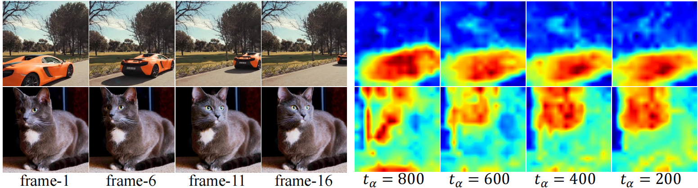
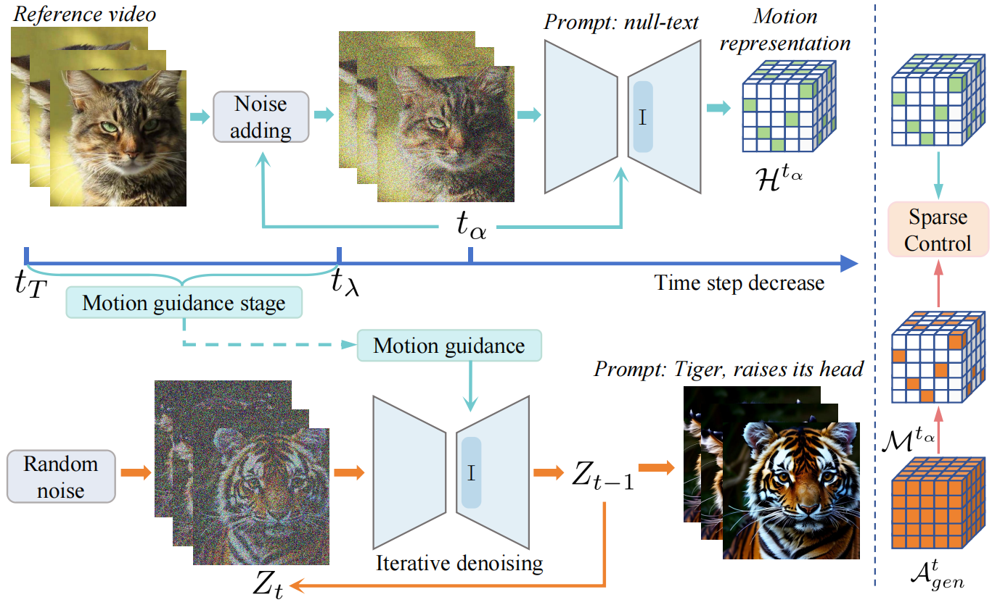

# MotionClone
This repository is the official implementation of [MotionClone](https://arxiv.org/abs/2406.05338). It is a **training-free framework** that enables motion cloning from a reference video for controllable video generation, **without cumbersome video inversion processes**.
<details><summary>Click for the full abstract of MotionClone</summary>

> Motion-based controllable video generation offers the potential for creating captivating visual content. Existing methods typically necessitate model training to encode particular motion cues or incorporate fine-tuning to inject certain motion patterns, resulting in limited flexibility and generalization.
In this work, we propose **MotionClone** a training-free framework that enables motion cloning from reference videos to versatile motion-controlled video generation, including text-to-video and image-to-video. Based on the observation that the dominant components in temporal-attention maps drive motion synthesis, while the rest mainly capture noisy or very subtle motions, MotionClone utilizes sparse temporal attention weights as motion representations for motion guidance, facilitating diverse motion transfer across varying scenarios. Meanwhile, MotionClone allows for the direct extraction of motion representation through a single denoising step, bypassing the cumbersome inversion processes and thus promoting both efficiency and flexibility. 
Extensive experiments demonstrate that MotionClone exhibits proficiency in both global camera motion and local object motion, with notable superiority in terms of motion fidelity, textual alignment, and temporal consistency.
</details>

**[MotionClone: Training-Free Motion Cloning for Controllable Video Generation](https://arxiv.org/abs/2406.05338)** 
</br>
[Pengyang Ling*](https://github.com/LPengYang/),
[Jiazi Bu*](https://github.com/Bujiazi/),
[Pan Zhang<sup>†</sup>](https://panzhang0212.github.io/),
[Xiaoyi Dong](https://scholar.google.com/citations?user=FscToE0AAAAJ&hl=en/),
[Yuhang Zang](https://yuhangzang.github.io/),
[Tong Wu](https://wutong16.github.io/),
[Huaian Chen](https://scholar.google.com.hk/citations?hl=zh-CN&user=D6ol9XkAAAAJ),
[Jiaqi Wang](https://myownskyw7.github.io/),
[Yi Jin<sup>†</sup>](https://scholar.google.ca/citations?hl=en&user=mAJ1dCYAAAAJ)  
(*Equal Contribution)(<sup>†</sup>Corresponding Author)

<!-- [Arxiv Report](https://arxiv.org/abs/2307.04725) | [Project Page](https://animatediff.github.io/) -->
[](https://arxiv.org/abs/2406.05338)
<!-- [](https://bujiazi.github.io/motionclone.github.io/) -->
<!-- [](https://bujiazi.github.io/motionclone.github.io/) -->

## Demo
[![]](https://github.com/user-attachments/assets/d1f1c753-f192-455b-9779-94c925e51aaa)


## 🖋 News
- The latest version of our paper (**v4**) is available on arXiv! (10.08)
- The latest version of our paper (**v3**) is available on arXiv! (7.2)
- Code released! (6.29)

## 🏗️ Todo
- [x] We have updated the latest version of MotionCloning, which performs motion transfer **without video inversion** and supports **image-to-video and sketch-to-video**.
- [x] Release the MotionClone code (We have released **the first version** of our code and will continue to optimize it. We welcome any questions or issues you may have and will address them promptly.)
- [x] Release paper

## 📚 Gallery
We show more results in the [Project Page](https://bujiazi.github.io/motionclone.github.io/).

## 🚀 Method Overview
### Feature visualization
<div align="center">
    
</div>

### Pipeline
<div align="center">
    
</div>

MotionClone utilizes sparse temporal attention weights as motion representations for motion guidance, facilitating diverse motion transfer across varying scenarios. Meanwhile, MotionClone allows for the direct extraction of motion representation through a single denoising step, bypassing the cumbersome inversion processes and thus promoting both efficiency and flexibility.

## 🔧 Installations (python==3.11.3 recommended)

### Setup repository and conda environment

```
git clone https://github.com/Bujiazi/MotionClone.git
cd MotionClone

conda env create -f environment.yaml
conda activate motionclone
```

## 🔑 Pretrained Model Preparations

### Download Stable Diffusion V1.5

```
git lfs install
git clone https://huggingface.co/runwayml/stable-diffusion-v1-5 models/StableDiffusion/
```

After downloading Stable Diffusion, save them to `models/StableDiffusion`. 

### Prepare Community Models

Manually download the community `.safetensors` models from [RealisticVision V5.1](https://civitai.com/models/4201?modelVersionId=130072) and save them to `models/DreamBooth_LoRA`. 

### Prepare AnimateDiff Motion Modules

Manually download the AnimateDiff modules from [AnimateDiff](https://github.com/guoyww/AnimateDiff), we recommend [`v3_adapter_sd_v15.ckpt`](https://huggingface.co/guoyww/animatediff/blob/main/v3_sd15_adapter.ckpt) and [`v3_sd15_mm.ckpt.ckpt`](https://huggingface.co/guoyww/animatediff/blob/main/v3_sd15_mm.ckpt). Save the modules to `models/Motion_Module`.

### Prepare SparseCtrl for image-to-video and sketch-to-video
Manually download "v3_sd15_sparsectrl_rgb.ckpt" and "v3_sd15_sparsectrl_scribble.ckpt" from [AnimateDiff](https://huggingface.co/guoyww/animatediff/tree/main). Save the modules to `models/SparseCtrl`.

## 🎈 Quick Start

### Perform Text-to-video generation with customized camera motion
```
python t2v_video_sample.py --inference_config "configs/t2v_camera.yaml" --examples "configs/t2v_camera.jsonl"
```
### Perform Text-to-video generation with customized object motion
```
python t2v_video_sample.py --inference_config "configs/t2v_object.yaml" --examples "configs/t2v_object.jsonl"
```
### Combine motion cloning with sketch-to-video
```
python i2v_video_sample.py --inference_config "configs/i2v_sketch.yaml" --examples "configs/i2v_sketch.jsonl"
```
### Combine motion cloning with image-to-video
```
python i2v_video_sample.py --inference_config "configs/i2v_rgb.yaml" --examples "configs/i2v_rgb.jsonl"
```


## 📎 Citation 

If you find this work helpful, please cite the following paper:

```
@article{ling2024motionclone,
  title={MotionClone: Training-Free Motion Cloning for Controllable Video Generation},
  author={Ling, Pengyang and Bu, Jiazi and Zhang, Pan and Dong, Xiaoyi and Zang, Yuhang and Wu, Tong and Chen, Huaian and Wang, Jiaqi and Jin, Yi},
  journal={arXiv preprint arXiv:2406.05338},
  year={2024}
}
```

## 📣 Disclaimer

This is official code of MotionClone.
All the copyrights of the demo images and audio are from community users. 
Feel free to contact us if you would like remove them.

## 💞 Acknowledgements
The code is built upon the below repositories, we thank all the contributors for open-sourcing.
* [AnimateDiff](https://github.com/guoyww/AnimateDiff)
* [FreeControl](https://github.com/genforce/freecontrol)
